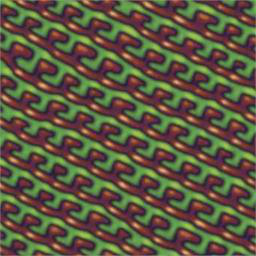
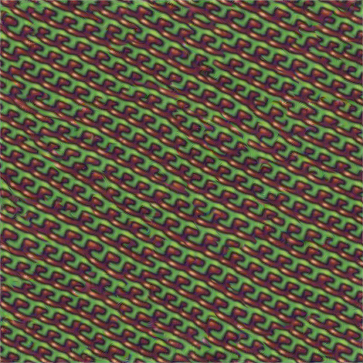

# A Sliced Wasserstein Loss for Neural Texture Synthesis

This is the official implementation of  ["A Sliced Wasserstein Loss for Neural Texture Synthesis" paper](https://arxiv.org/abs/2006.07229) (CVPR 2021).


If you use this work, please cite our paper
```Bibtex
@InProceedings{Heitz_2021_CVPR,
author = {Heitz, Eric and Vanhoey, Kenneth and Chambon, Thomas and Belcour, Laurent},
title = {A Sliced Wasserstein Loss for Neural Texture Synthesis},
booktitle = {IEEE/CVF Conference on Computer Vision and Pattern Recognition (CVPR)},
month = {June},
year = {2021}
}
```

This implementation focuses on the key part of the paper: the sliced wasserstein loss for texture synthesis.

## Requirements

### Librairies

The following libraries are required:

- pytorch
- numpy
- imageio

This code has been tested with Python 3.7.5 on Ubuntu 18.04.
We recommend setting up a dedicated Conda environment using Python 3.7.

### Pretrained vgg-19 network

A custom vgg network is used, as explained in the supplementals.
It has been modified compared to the pytorch standard model:

- inputs are preprocessed (including normalization with imagenet stats).
- activations are scaled.
- max pooling layers are replaced with average pooling layers.
- zero padding is remplaced with reflect padding.

## Texture generation

To generate a texture use the following command:

```eval
python texture_optimization_slicing.py
```

The parameters inside the file texture_optimization_slicing.py are:

- FILE_PATH: Target texture file.
- SCALING_FACTOR: Scaling factor of the optimized texture in regards to the example texture (set to 1 to keep the same size, 2 to double the resolution).

Outputs files are:

- optimized_texture_N_iterations.png: the intermediate result after N iterations. If there are 20 iterations, there will be 20 output images.


## Timing

Timing reference for 10 iterations on 256x256 resolution:

- NVIDIA Titan RTX: 1min05.

## Example of synthesis

This is an example of texture synthesis with SCALING_FACTOR=2:

- Input:



- Output: 

